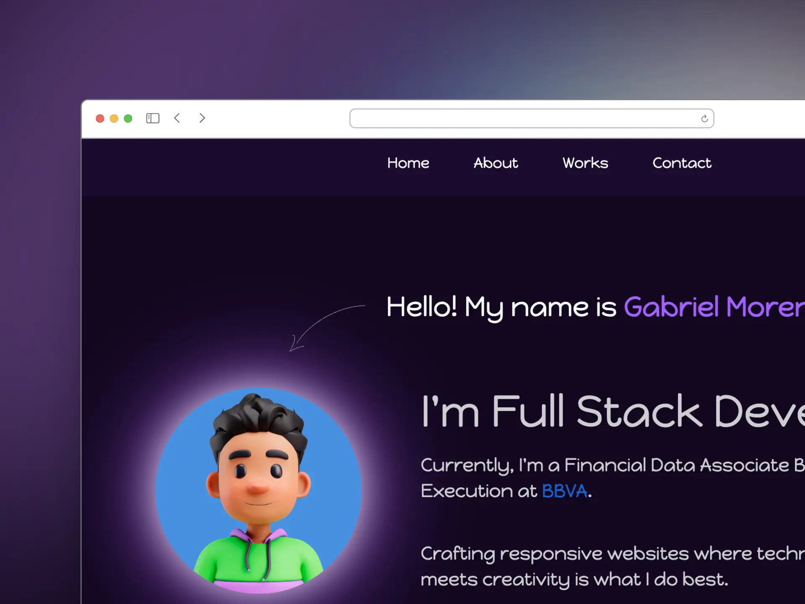

# gabomg.com

Mi personal site

</a>

 
 

## ⚒️ Stack

- **Framework**: [Astro](https://astro.build/)
- **Styling:** [Tailwind CSS](https://tailwindcss.com/)
- **Deployment:** [Netlify](https://netlify.com/)

## 🧞 Commands

All commands are run from the root of the project, from a terminal:

| Command                   | Action                                           |
| :------------------------ | :----------------------------------------------- |
| `npm install`             | Installs dependencies                            |
| `npm run dev`             | Starts local dev server at `localhost:4321`      |
| `npm run build`           | Build your production site to `./dist/`          |
| `npm run preview`         | Preview your build locally, before deploying     |
| `npm run astro ...`       | Run CLI commands like `astro add`, `astro check` |
| `npm run astro -- --help` | Get help using the Astro CLI                     |
| `node --run dev`          | Starts local dev server at `localhost:4321`      |
